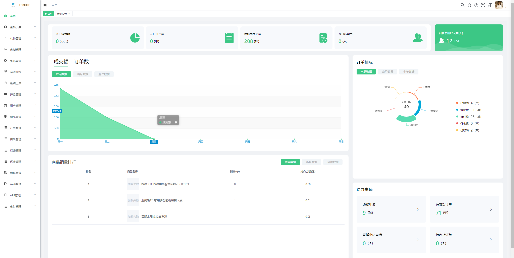

## 项目名称

* TSSHOP后台管理系统

```bash
# 克隆项目
git clone https://gitee.com/tsshop/tsshop-backend-web

# 进入项目目录
cd tsshop-admin-web

# 安装依赖
npm install

# 建议不要直接使用 cnpm 安装依赖，会有各种诡异的 bug。可以通过如下操作解决 npm 下载速度慢的问题
npm install --registry=https://registry.npmmirror.com

# 启动服务
npm run dev
```

浏览器访问 http://localhost:9071

## 发布

```bash
# 构建测试环境
npm run build:stage

# 构建生产环境
npm run build:prod
```

## 技术咨询

* 开源商城交流QQ群：856292894 (QQ)

## 效果


